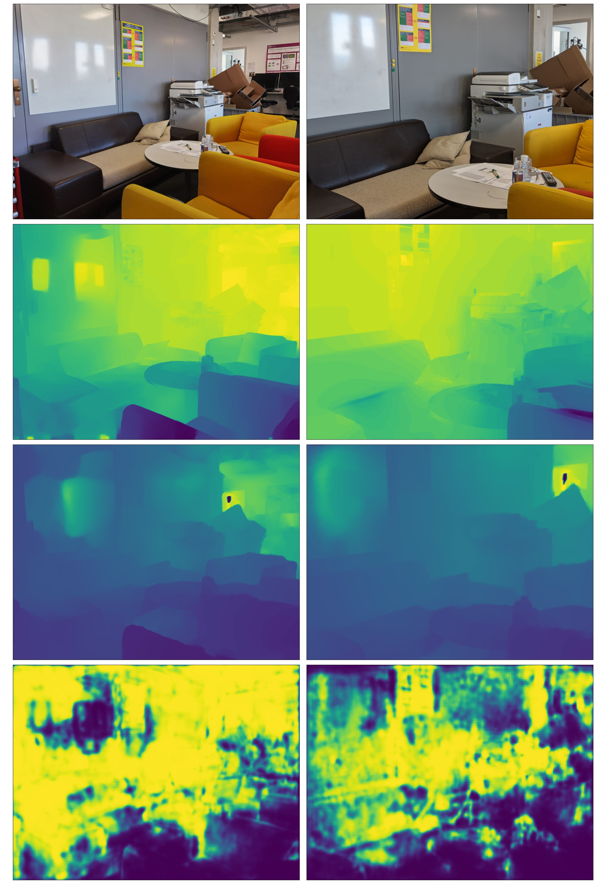

# PhoneDepth
PhoneDepth: Dataset toolbox and documentation for the paper of MAI2022 workshop.


## Development setup
This repository is based on the setup described by the `environment.yml` file and is supposed to be used with conda. One can create the conda environment with the command: 

```
conda env create -f environment.yml
```

Note that the key dependencies are:
- Tensorflow >=2.4.1
- Tensorflow-addons >= 0.14.0 (Corresponding to Tensorflow version)
- Tensorflow-probability >=0.7 (Corresponding to Tensorflow version)


## Dataset download
We recommend you keep all the datasets under the same directory (`*/data`), although it is not necesary.

### Data-set lists
The data lists corresponding representing the splits used to acquire this paper's results can be downloaded from [here](https://drive.google.com/file/d/1uDzpz-pVIPAnabLigE1ThwF40QbhfI6-/view?usp=sharing).  It is composes of the following directory structure whear each superficial directory corresponds to each dataset:

```bash
├── MAI
│   ├── train.npy
│   └── val.npy
├── MegaDepth
│   ├── final_list
│   │   └── **
│   └── wo_ordinal_list
│       └── **
└── PhoneDepth
    ├── test_list.json
    ├── train_list.json
    └── validation_list.json
```
### Megadepth
Download and extract [MegaDepth V1](https://www.cs.cornell.edu/projects/megadepth/) dataset. Place the `MegaDepth` data-set list directory contents inside the top level directory of the dataset after extracting. 
### Mobile AI (MAI)
Download Publicly available data on: [Mobile AI](https://competitions.codalab.org/competitions/28122). You will need to be signed-in to access the data. Extract the dataset from the compressed file. Then you should include the data-lists corresponding to `MAI` in the previous section. You want to have a file structure as follows:

```bash
MAI2021_depth_dir (as per downloaded or how you named it)
└── train
    ├── rgb
    ├── depth
    ├── train.npy
    └── val.npy
```

### PhoneDepth
Download dataset available in [PhoneDepth](placeholder). Extract it and place the `PhoneDepth` data-lists in the root directory of the dataset. You want to have a file structure as follows:

```bash
PhoneDepth (as per downloaded or how you named it)
├── hua
├── networks
├── p_depth_logs
├── p_eval_outputs
├── p_networks
├── test_list.json
├── train_lists.json
└── validation_list.json
```

## Content Description
Here we describe the contents and the file structure of this repository.
----------------------- ------------------------------------
- ***dataset_utils***: Includes data loading related functionalities including data loaders, data list generation (Megadepth), augmentation and visualizaiton.
- ***ml_evaluation_scripts***: Includes a script to perform evaluation in all datasets.
- ***ml_training_scripts***: Includes scripts used to train our models and a script for generic training (`general_train.py`) which you should refer to for training.
- ***models***: Contains models deffinitions and utilities to construct them. You should refer to `models.py` as an entry point.
- ***notebooks_testing***: Notebooks used for a variety of purposes, mainly visualizing datasets.
- ***plotting***: Utilities to plot significant data corresponding to results.
- ***unit_tests***: Unit testing, primarlly for models and augmentaiton.
- ***custom_callbacks.py**: Custom callback functions to use during evaluation (To extract also some examples).
- ***depth_utils.py***: Loss and metric functions for training and evaluation.
- ***environment.yml***: description of Conda environment.
- ***misc.py***: Logging related functions.
----------------------------------------------------------------

### Training and Evaluation

Two scripts can be used for you to train and evaluate on the mentioned datasets:
- `ml_training_scripts/general_train.py`
- `ml_evaluation_scripts/general_eval.py`

In both sripts please change the following variables accordingly options:
- `megadepth_basepath`: Base path of megadepth dataset.
- `mai_basepath`: Base path of MAI dataset.
- `mb_basepath`: Base path of PhoneDepth dataset.
- `dataset`: dataset to use. one of: 
    - `md`: MegaDepth
    - `mai`: MAI
    - `mb`: PhoneDepth
- `model_name`: Name of the model to be loaded. All the models used for the paper are listed (commented out) in the eval/train file.
- `input_size`: 3-tuple with input dimentions. Should be (x, x, 3), x representing widht and height of the image.
- `pretrained_weights`: Pretrained weights to load to start from.

### Dataset samples
Here we provide with some samples from the dataset. The samples collect the following information in top to bottom order for both Huawei and Pxl phones:
1. Phone image
2. Phone sensor depth
3. Stereo based depth
4. Confidence map for stereo based depth

Sample 1


Sample 2

